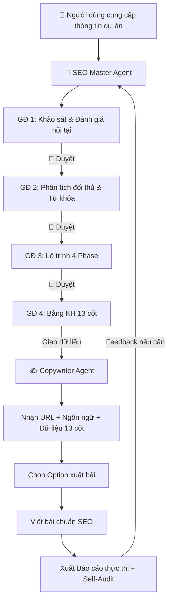

# 🚀 SEO Agent Skills — by SaoLabs

> Hệ thống AI Agent chuyên biệt cho SEO, được thiết kế theo kiến trúc **hai tầng phân vai** (Strategist → Executor) nhằm tự động hóa toàn bộ quy trình từ hoạch định chiến lược đến thực thi nội dung chuẩn SEO.

---

## 📖 Mục lục

- [Tổng quan](#tổng-quan)
- [Kiến trúc hệ thống](#kiến-trúc-hệ-thống)
- [Các Agent](#các-agent)
  - [SEO Master Agent (Strategist)](#1-seo-master-agent--strategist--project-manager)
  - [Copywriter Agent (Executor)](#2-copywriter-agent--executor)
- [Quy trình vận hành](#quy-trình-vận-hành)
- [Bảng Kế hoạch 13 Cột](#bảng-kế-hoạch-13-cột)
- [Tính năng nổi bật](#tính-năng-nổi-bật)
- [Cấu trúc thư mục](#cấu-trúc-thư-mục)
- [Hướng dẫn sử dụng](#hướng-dẫn-sử-dụng)
- [Nguyên tắc thiết kế](#nguyên-tắc-thiết-kế)
- [License](#license)

---

## Tổng quan

**SEO Agent Skills** là bộ skill/prompt chuyên dụng dành cho các AI Agent, giúp xây dựng và thực thi chiến dịch SEO chuyên nghiệp theo hướng **Data-Driven**. Hệ thống được thiết kế với triết lý:

- **Văn phong con người là ưu tiên tối thượng** — không đánh đổi sự tự nhiên để nhồi nhét SEO.
- **Chất lượng nội dung E-E-A-T** — đảm bảo chiều sâu, bảo chứng sự thật, đặc biệt với chủ đề YMYL.
- **Tối ưu kỹ thuật SEO Rank Math 100/100** — cấu trúc AEO, mật độ từ khóa, internal linking chuẩn chỉnh.

---

## Kiến trúc hệ thống

```
┌─────────────────────────────────────────────────────────────┐
│                    SEO AGENT SKILLS                         │
├─────────────────────┬───────────────────────────────────────┤
│                     │                                       │
│   SEO MASTER AGENT  │         COPYWRITER AGENT              │
│   (Bộ não chiến     │         (Thợ xây bậc thầy)            │
│    lược - Bản vẽ)   │                                       │
│                     │                                       │
│  ┌───────────────┐  │  ┌─────────────────────────────────┐  │
│  │ GĐ 1: Khảo sát│  │  │ Nhận Bảng KH 13 cột            │  │
│  │ GĐ 2: Đối thủ │──┼─▶│ Viết bài chuẩn SEO Rank Math   │  │
│  │ GĐ 3: Lộ trình│  │  │ Xuất Báo cáo thực thi          │  │
│  │ GĐ 4: KH 13cột│  │  │ Tự kiểm duyệt (Self-Audit)     │  │
│  │ GĐ 5: Dàn ý   │  │  └─────────────────────────────────┘  │
│  │ GĐ 6: Audit   │  │                                       │
│  └───────────────┘  │                                       │
└─────────────────────┴───────────────────────────────────────┘
```

**Luồng dữ liệu:**
1. **Master Agent** phân tích thị trường, đối thủ, nghiên cứu từ khóa → xuất **Bảng Kế hoạch 13 cột**.
2. **Copywriter Agent** nhận dữ liệu từ Bảng 13 cột → thực thi viết bài → xuất **Báo cáo thực thi nội dung SEO**.

---

## Các Agent

### 1. SEO Master Agent — Strategist & Project Manager

> **File:** [`SEO-MASTER-AGENT.md`](SEO-MASTER-AGENT.md) · **Chi tiết:** [`docs/Master.md`](docs/Master.md)

**Vai trò:** Giám đốc SEO (SEO Director) — chịu trách nhiệm hoạch định chiến lược dài hạn và quản trị kế hoạch nội dung.

#### Năng lực cốt lõi

| Năng lực | Mô tả |
|----------|--------|
| **Tư duy SEO bao quát** | Phát triển song song Nhánh chính (sản phẩm/dịch vụ) và Nhánh phụ (nguyên nhân gốc rễ, kiến thức giáo dục) để xây dựng Topical Authority |
| **Bóc tách từ khóa bảo toàn ngữ nghĩa** | Quy trình 3 bước: Tìm từ khóa gốc → Bóc tách cụm lõi 2-5 từ (chỉ khi không sai nghĩa) → Bảo toàn ngữ cảnh tại Cột 13 |
| **Phân bổ Topic Cluster động** | Tự tính toán tỷ trọng nội dung (VD: 60/40) cho 3-4 cụm chủ đề trong từng Phase |
| **Kỷ luật bảng dữ liệu thép** | Xuất Markdown Table chuẩn, cấm xuống dòng trong ô, dùng `;` phân cách — tương thích Google Sheets/Excel |
| **Kiến trúc đa ngôn ngữ** | Cột 3-7 dùng ngôn ngữ mục tiêu, Cột 8-13 dùng tiếng Việt |
| **Khóa chuẩn E-E-A-T** | Bắt buộc tham chiếu nguồn uy tín (PubMed, WHO, Dược thư QG) cho chủ đề YMYL |

#### Quy trình 6 Giai đoạn

| GĐ | Tên | Output chính | Dừng? |
|----|-----|-------------|-------|
| 1 | Khảo sát thị trường & Đánh giá nội tại | Báo cáo Self-Audit, Chân dung khách hàng | 🛑 |
| 2 | Giải phẫu đối thủ & Nghiên cứu từ khóa | Báo cáo SWOT, Phân nhóm từ khóa, Content Gap | 🛑 |
| 3 | Lộ trình chiến lược dài hạn | Bảng Roadmap 4 Phase, Topic Matrix | 🛑 |
| 4 | **Kế hoạch nội dung** (quan trọng nhất) | **Bảng KH 13 cột**, Bảng Internal Link, Brief tài nguyên | 🛑 |
| 5 | Dàn ý | Cấu trúc H1-H3 + Meta Data | 🛑 |
| 6 | Audit | Kiểm tra SEO & gợi ý Content Refresh | — |

> Mỗi giai đoạn **DỪNG LẠI** chờ xác nhận từ người dùng trước khi tiếp tục, đảm bảo kiểm soát chất lượng.

---

### 2. Copywriter Agent — Executor

> **File:** [`COPYWRITER-AGENT.md`](COPYWRITER-AGENT.md) · **Chi tiết:** [`docs/Copywriter.md`](docs/Copywriter.md)

**Vai trò:** Copywriter SEO Cao cấp, Chuyên gia AEO (AI Search) & Biên tập viên — thực thi viết bài từ dữ liệu Bảng KH 13 cột.

#### Thứ tự ưu tiên tối thượng

```
(1) Văn phong tự nhiên → (2) Chất lượng nội dung → (3) Tối ưu kỹ thuật SEO
```

#### Năng lực cốt lõi

| Năng lực | Mô tả |
|----------|--------|
| **Anti-Context Bleeding** | Cơ chế làm sạch bộ nhớ — chỉ giữ dữ liệu yêu cầu hiện tại, xóa bài viết cũ tránh lẫn lộn |
| **Human-like Engine** | Bộ lọc chống "văn mẫu AI", trộn nhịp câu ngắn/dài, chuyển ý mượt mà |
| **Phiên dịch chuyên môn** | Biến kiến thức hàn lâm thành ngôn ngữ đại chúng, gần gũi |
| **Nhận diện Phễu tự động** | TOFU (giáo dục) → MOFU (phân tích) → BOFU (chuyển đổi) |
| **AEO Answer-first** | Tạo đoạn 40-80 từ trả lời trực diện dưới H1 cho AI Search |
| **Rank Math 100/100** | Mật độ từ khóa 0.6-1.5%, rải đều H2/H3, Meta Data chuẩn |
| **Kỷ luật Link & Media** | Chèn link chuẩn Markdown, placeholder `[Image]`/`[Video]` với Alt text chứa từ khóa |

#### 3 Option xuất bài

| Option | Mô tả |
|--------|--------|
| **Option 1** | Hướng dẫn Dàn ý — chỉ xuất H1-H3 + Meta Data |
| **Option 2** | Viết bài trực tiếp — hiển thị theo form Báo cáo thực thi |
| **Option 3** | Xuất Raw Markdown — bọc trong code block để copy dễ dàng |

#### Cấu trúc Output: Báo cáo thực thi

```
# BÁO CÁO THỰC THI NỘI DUNG SEO
├── Tiến độ / Bài viết
├── Chủ đề
│
├── 1. NỘI DUNG BÀI VIẾT
│   ├── H1 + Đoạn Answer-first (40-80 từ)
│   ├── H2/H3 + Nội dung phân tích
│   ├── [Image]/[Video] Placeholder + Alt text
│   └── Internal/External Links
│
├── 2. SIÊU DỮ LIỆU SEO
│   ├── Meta Title (<60 ký tự)
│   ├── Meta Description (<160 ký tự)
│   └── URL Slug (~75 ký tự, không dấu)
│
└── 3. ĐÁNH GIÁ CHẤT LƯỢNG & KỸ THUẬT (Self-Audit)
    ├── Chất lượng nội dung
    ├── Văn phong con người
    ├── Độ dài bài viết
    └── Điểm SEO ước lượng (100/100 Rank Math)
```

---

## Quy trình vận hành



---

## Bảng Kế hoạch 13 Cột

Đây là **cầu nối dữ liệu** giữa Master Agent và Copywriter Agent:

| Cột | Tên | Ngôn ngữ | Ghi chú |
|-----|-----|----------|---------|
| 1 | Tháng/Năm | — | Mốc thời gian |
| 2 | Tuần - Bài | — | Tiến độ |
| 3 | Topic Cluster - Loại trang | Mục tiêu | Dùng dấu `-` ngăn cách |
| 4 | Danh mục | Mục tiêu | — |
| 5 | Tiêu đề | Mục tiêu | Tối ưu CTR |
| 6 | **Keyword chính** | Mục tiêu | Cụm lõi 2-5 từ, không dấu câu |
| 7 | Keyword phụ | Mục tiêu | LSI, phân cách bằng `,` |
| 8 | Funnel | Tiếng Việt | TOFU / MOFU / BOFU |
| 9 | CTA | Tiếng Việt | Lời kêu gọi hành động |
| 10 | Link | Tiếng Việt | ≥2 Internal + 1 External, dùng `;` |
| 11 | Media | Tiếng Việt | Cú pháp: `[Hx] Tên phần -> Số + Loại` |
| 12 | Yêu cầu Kiến thức | Tiếng Việt | Nguồn E-E-A-T, dùng `;` |
| 13 | **Hướng dẫn triển khai** | Tiếng Việt | Câu văn mẫu chứa từ khóa dài đầy đủ ngữ nghĩa |

> ⚠️ **Kỷ luật thép:** Tuyệt đối không xuống dòng trong ô. Dùng `;` phân cách nhiều mục.

---

## Tính năng nổi bật

### 🎯 Thuật toán Bóc tách Từ khóa "Bảo toàn ngữ nghĩa"

Giải quyết mâu thuẫn giữa công cụ SEO (cần từ khóa ngắn) và văn phong tự nhiên (cần câu hoàn chỉnh):

```
Truy vấn gốc: "Niềng răng có đau không"
     │
     ▼ Bước 1: Giữ nguyên (2-7 từ, xóa dấu câu)
"niềng răng có đau không"
     │
     ▼ Bước 2: Thử bóc tách → ❌ "niềng răng có đau" = sai nghĩa
     │  → GIỮ NGUYÊN bản gốc
     │
     ▼ Bước 3: Đẩy phiên bản dài vào Cột 13
Câu văn mẫu: "Nhiều bệnh nhân thắc mắc niềng răng có đau không..."
```

### 🌐 Kiến trúc đa ngôn ngữ (Bilingual Architecture)

Hỗ trợ chiến dịch SEO đa thị trường với quy tắc phân luồng ngôn ngữ rõ ràng trong Bảng 13 cột.

### 🔄 Phân bổ Topic Cluster Động

4 Phase chiến lược với tỷ trọng linh hoạt:

| Phase | Mục tiêu | Phân bổ |
|-------|----------|---------|
| Phase 1 | Bao phủ & Lên top | 40-50% Cluster chủ đạo, 50-60% bổ trợ |
| Phase 2 | Củng cố | 40% chuyên sâu E-E-A-T, 60% rải đều |
| Phase 3 | Mở rộng | 50-60% ngách mới, 40% duy trì cũ |
| Phase 4 | Cập nhật | Refresh nội dung cũ + Hot trend |

### 🛡️ Cơ chế Anti-Context Bleeding

Copywriter Agent tự động xóa ngữ cảnh bài viết cũ sau mỗi lần thực thi, tránh tình trạng "râu ông nọ cắm cằm bà kia" khi xử lý hàng loạt.

---

## Cấu trúc thư mục

```
seo-agent-skills/
├── README.md                  # Tài liệu tổng quan (file này)
├── SEOMASTER-AGENT.md        # Prompt/Skill cho Master Agent
├── COPYWRITER-AGENT.md       # Prompt/Skill cho Copywriter Agent
└── docs/
    ├── Master.md              # Giải thích chi tiết Master Agent
    └── Copywriter.md          # Giải thích chi tiết Copywriter Agent
```

| File | Mục đích |
|------|----------|
| `SEOMASTER-AGENT.md` | **Prompt gốc** — copy trực tiếp vào AI Agent để kích hoạt vai trò Strategist |
| `COPYWRITER-AGENT.md` | **Prompt gốc** — copy trực tiếp vào AI Agent để kích hoạt vai trò Copywriter |
| `docs/Master.md` | Tài liệu giải thích năng lực và thiết kế của Master Agent |
| `docs/Copywriter.md` | Tài liệu giải thích năng lực và thiết kế của Copywriter Agent |

---

## Hướng dẫn sử dụng

### Bước 1 — Khởi tạo Master Agent

Copy nội dung `SEOMASTER-AGENT.md` vào AI chatbot (Gemini, ChatGPT, Claude...) dưới dạng **System Prompt** hoặc **Custom Instructions**.

Agent sẽ chào và hỏi bạn muốn:

1. **Lên Chiến lược SEO dài hạn** (GĐ 1-3)
2. **Xuất Kế hoạch nội dung** cho tháng X (GĐ 4-6)
3. **Chạy Quick Plan**

### Bước 2 — Hoạch định chiến lược

Cung cấp cho Master Agent:

- URL website đích
- Thị trường + Ngôn ngữ mục tiêu
- Sản phẩm/Ngành nghề
- Timeline (tùy chọn — Agent sẽ tự đề xuất nếu không có)
- Lịch sử SEO (nếu có)

Duyệt qua từng giai đoạn (1 → 2 → 3 → 4) để nhận **Bảng Kế hoạch 13 cột**.

### Bước 3 — Khởi tạo Copywriter Agent

Copy nội dung `COPYWRITER-AGENT.md` vào một phiên AI mới.

Cung cấp 4 thông tin bắt buộc:

1. URL đích
2. Ngôn ngữ
3. **1 dòng dữ liệu** từ Bảng KH 13 cột
4. Dữ liệu đính kèm / Bảng Internal Link (nếu có)

### Bước 4 — Chọn Option và nhận bài viết

Chọn 1 trong 3 Option xuất bài → Nhận Báo cáo thực thi hoàn chỉnh.

> 💡 **Mẹo:** Sử dụng **Option 3 (Raw Markdown)** để copy nhanh vào WordPress/CMS.

---

## Nguyên tắc thiết kế

### Tại sao tách thành 2 Agent?

| Vấn đề | Giải pháp |
|--------|-----------|
| Context window hữu hạn | Mỗi Agent chỉ tập trung 1 nhiệm vụ, tối ưu bộ nhớ |
| Chất lượng output giảm khi prompt quá dài | Phân tách giúp mỗi prompt ngắn gọn, tập trung |
| Khó kiểm soát chất lượng end-to-end | Checkpoint 🛑 sau mỗi giai đoạn cho phép can thiệp |
| Context bleeding khi viết hàng loạt | Copywriter Agent có cơ chế reset bộ nhớ |

### Triết lý "Con người trước, SEO sau"

Hệ thống được thiết kế với nguyên tắc **không đánh đổi** sự tự nhiên của văn phong để nhồi nhét kỹ thuật SEO. Thay vào đó, sử dụng cơ chế **Câu văn mẫu (Cột 13)** để cầu nối giữa cụm từ khóa lõi ngắn gọn và câu văn hoàn chỉnh tự nhiên.

---

## License

© SaoLabs — All rights reserved.
